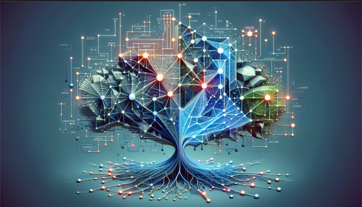

# Welcome To The Machine Learning World! 👋

## Introduction
Here we want to start a journey and learn everything from sctrach. Therefore, no need to worry about not having a robust backgroung in this field of study.

We are using [this repo](https://github.com/rasbt/machine-learning-book) as our reference. For further information, you can read the book they have provided. Below, you find a list of contents we are about to cover. Commence the exploration to become hero from zero 😎.

## Table of Contents
1. [Chapter 1:](./chapters/01-Machine-Learning-Overview/ch01.ipynb) Machine Learning Overview
2. [Chapter 2:](./chapters/02-Training/ch02.ipynb) Training
3. [Chapter 3:](./chapters/03-Classifiers/ch03.ipynb) Classifiers
4. [Chapter 4:](./chapters/04-Pre-Processing/ch04.ipynb) Pre-Processing
5. [Chapter 5:](./chapters/05-Data-Compression/ch05.ipynb) Data Compression
6. [Chapter 6:](./chapters/06-Model-Evaluation/ch06.ipynb) Model Evaluation
7. [Chapter 7:](./chapters/07-Ensemble-Learning/ch07.ipynb) Ensemble Learning
8. [Chapter 8:](./chapters/08-Sentiment-Analysis/ch08.ipynb) Sentiment Analysis
9. [Chapter 9:](./chapters/09-Regression/ch09.ipynb) Regression
10. [Chapter 10:](./chapters/10-Clustering/ch10.ipynb) Clustering
11. [Chapter 11:](./chapters/11-Multi-Layer-Neural-Network/ch11.ipynb) Multi-Layer Neural Network
12. [Chapter 12:](./chapters/12-Parallelization/ch12.ipynb) Parallelization
13. [Chapter 13:](./chapters/13-PyTorch-In-Depth/ch13.ipynb) PyTorch In-Depth
14. [Chapter 14:](./chapters/14-CNN/ch14.ipynb) CNN
15. [Chapter 15:](./chapters/15-RNN/ch15.ipynb) RNN
16. [Chapter 16:](./chapters/16-NLP/ch16.ipynb) NLP
17. [Chapter 17:](./chapters/17-GAN/ch17.ipynb) GAN
18. [Chapter 18:](./chapters/18-GNN/ch18.ipynb) GNN
19. [Chapter 19:](./chapters/19-RL/ch19.ipynb) RL
