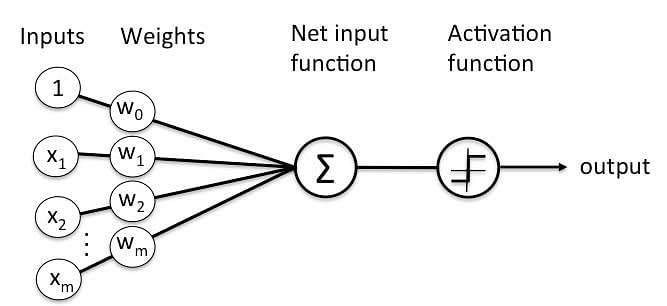

# Chapter 2: Training

In this chapter, we are going to learn what **"Training"** is by an example associated with perceptron. But first:

## What is Perceptron

A perceptron is a fundamental building block in machine learning, particularly in binary classification tasks. It's a simplified model of a biological neuron, taking multiple inputs, applying weights to each, summing them up, and passing the result through an activation function to produce an output. The perceptron learns by adjusting its weights based on the errors in its predictions, aiming to minimize them during training. While limited to linearly separable problems and prone to convergence issues, perceptrons serve as the basis for more complex neural network architectures, contributing to the foundation of modern deep learning.