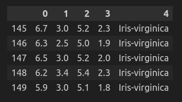
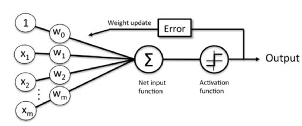

# Chapter 2: Training

In this chapter, we are going to learn what **"Training"** is by an example associated with perceptron. But first:

## What is Perceptron

A perceptron is a fundamental building block in machine learning, particularly in binary classification tasks. It's a simplified model of a biological neuron, taking multiple inputs, applying weights to each, summing them up, and passing the result through an activation function to produce an output. The perceptron learns by adjusting its weights based on the errors in its predictions, aiming to minimize them during training. While limited to linearly separable problems and prone to convergence issues, perceptrons serve as the basis for more complex neural network architectures, contributing to the foundation of modern deep learning.

## Dataset
We have used the famous Iris dataset which is available [here](https://archive.ics.uci.edu/ml/machine-learning-databases/iris/iris.data). Here is a snippet of this dataset after loading it in a dataframe:

## Adaptive Linear Neurons (Adaline)

Adaptive Linear Neurons (Adaline) are a type of artificial neuron, often used in supervised learning for binary classification tasks. Adaline is similar to the perceptron in that it takes multiple input features, applies weights to them, sums them up, and passes the result through an activation function to produce an output. However, unlike the perceptron, Adaline's activation function is a linear function instead of a step function.

Adaline's key feature is its learning rule, which is based on the gradient descent optimization technique. This learning rule adjusts the weights iteratively to minimize a cost function, typically the sum of squared errors between the predicted outputs and the true targets. By continuously updating the weights based on the gradient of this cost function, Adaline aims to find the optimal weights that minimize prediction errors.

Regarding convergence of learning, it's crucial for algorithms like Adaline to converge to a solution, meaning that the weights stabilize and no longer change significantly with further iterations. Convergence ensures that the algorithm has found the optimal or near-optimal weights that minimize the cost function. In the context of Adaline, convergence is achieved when the weights no longer change significantly across iterations, or when the cost function reaches a minimum value. Techniques like setting a maximum number of iterations or a threshold for the change in weights are often used to monitor convergence during training.

