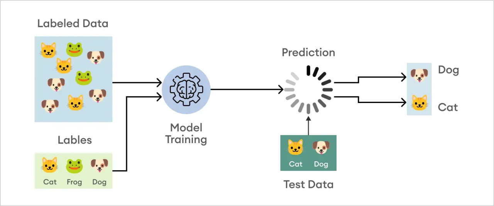
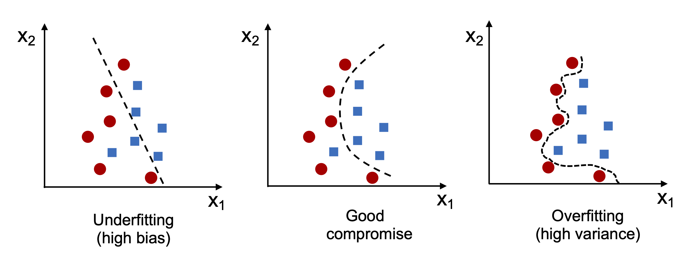

# Chapter 3: Classification

## What is Classification

Classification is a fundamental task in machine learning where the goal is to predict the class or category of a given input data point based on its features. It involves training a model on a labeled dataset, where each data point is associated with a target class. The model learns patterns and relationships in the data to make predictions on unseen data points.

## Algorithms
In this chapter, we are going to explore different algorithms that are widely used for classification problmes. There are examples for these classification algorithms in this chapter's notebook:
- **Perceptron**
- **Logistic regression** 
- **support vector machines (SVM)**
- **Decision trees**
- **K-nearest neighbors (KNN)**

## Tackling Overfitting/Underfitting

For resolving this issues, a regularization method has been applied. Generally, to tackle overfitting and underfitting, which are common challenges in machine learning, several techniques can be employed. A few of them are reviewed below:
- **Regularization:** Regularization methods like L1 (Lasso) and L2 (Ridge) regularization add a penalty term to the loss function, discouraging overly complex models with large parameter values. This helps prevent overfitting by promoting simpler models.
- **Cross-validation:** Utilize techniques like k-fold cross-validation to evaluate model performance on different subsets of the data. This helps detect overfitting by assessing how well the model generalizes to unseen data.
- **Data augmentation:** Increase the size and diversity of the training data through techniques like rotation, translation, or adding noise, which can help the model generalize better and reduce overfitting.