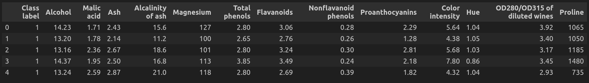

# Chapter 4: Pre Processing

## What is Preprocessing
Preprocessing is a crucial step in machine learning pipelines that involves transforming raw data into a format suitable for modeling. It encompasses various techniques aimed at cleaning, transforming, and preparing the data to improve the performance and reliability of machine learning models.

## Techniques
Here are some well-known techniques that are used to prepare the data before using it in ML processes:

### Data Cleaning
This involves handling missing values, dealing with outliers, and removing noise from the dataset. Techniques like imputation, outlier detection, and smoothing can be used for data cleaning.

### Data Transformation
Data may need to be transformed to meet the assumptions of the chosen model. Common transformations include normalization, standardization, and scaling, which ensure that features have similar scales and distributions.

### Feature Engineering
Feature engineering involves creating new features or modifying existing ones to improve model performance. This can include techniques like one-hot encoding for categorical variables, creating interaction terms, or deriving new features from existing ones.

### Dimensionality Reduction
In cases where the dataset has a large number of features, dimensionality reduction techniques like Principal Component Analysis (PCA) or feature selection methods can be applied to reduce the number of features while preserving as much information as possible.

### Data Encoding
Categorical variables often need to be encoded into numerical format for machine learning algorithms to process. Techniques like one-hot encoding or label encoding can be used for this purpose.

### Data Splitting
The dataset is typically split into training, validation, and testing sets to evaluate the model's performance. This ensures that the model's performance can be assessed on unseen data.

## Dataset
We have used the famous wine dataset which is available [here](https://archive.ics.uci.edu/ml/machine-learning-databases/iris/iris.data). Here is a snippet of this dataset after loading it in a dataframe:

