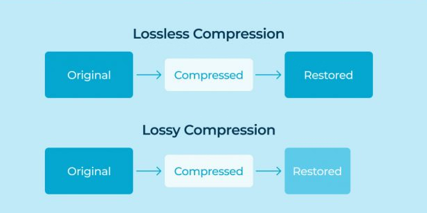

# Chapter 5: Data Compression

## What is Data Compression

Data compression in machine learning (ML) refers to the methods and techniques used to reduce the size of data without significant loss of information. This process allows ML models to be trained and infer with reduced computational resources, storage, and transmission requirements. Here are different types of data compressions that are being used:

### Lossless Compression
Original data can be perfectly reconstructed.
- **Example:** Run-Length Encoding (RLE), Huffman Coding, Arithmetic Coding, and Lempel-Ziv-Welch (LZW).
- **Use Case:** Text data, exact feature reconstruction required.

### Lossy Compression
Some data is lost, but perceptual or statistical quality remains high.
- **Example:** JPEG (images), MP3 (audio), Video codecs.
- **Use Case:** Images, audio, and when minor information loss is acceptable.

## Compression Techniques in ML

**1. Dimensionality Reduction**
- **Principal Component Analysis (PCA):** Projects data to a lower-dimensional space while retaining most variance.
- **t-Distributed Stochastic Neighbor Embedding (t-SNE):** Non-linear dimensionality reduction for visualization.
- **Autoencoders:** Neural networks that learn efficient encodings by training to reconstruct the input.

**2. Model Compression Techniques**
- **Quantization:** Reducing the precision of weights (e.g., 32-bit floats to 8-bit integers).
- **Pruning:** Removing unnecessary weights or neurons in a network.
- **Knowledge Distillation:** Training a smaller model to mimic a larger model.

**3. Sparse Representations**
- Represent data using sparse structures that require less memory. For example, sparse matrices or graphs, word embeddings with sparsity.

**4. Embedding Representations**
- **Word Embeddings:** Mapping words to dense vectors (e.g., Word2Vec, GloVe).
- **Image/Video Embeddings:** Compact representations learned via convolutional neural networks (CNNs).

**5. Feature Selection**
- Selecting only the most important features for training models, reducing data size and computational complexity.

## Dataset
We have used the famous wine dataset which is available [here](https://archive.ics.uci.edu/ml/machine-learning-databases/wine/wine.data). Here is a snippet of this dataset after loading it in a dataframe:

