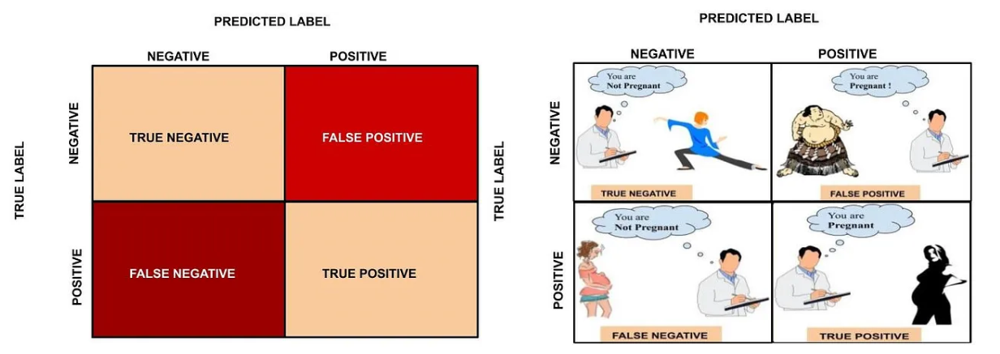
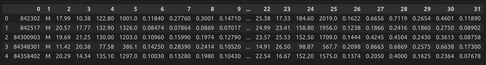

# Chapter 6: Model Evaluation

## What is Model Evaluation
Model evaluation is a critical step in machine learning that determines how well a model generalizes to new, unseen data. Proper evaluation ensures that a model's performance reflects its real-world applicability rather than just fitting the training data.

## Types of Model Evaluation

**1. Cross-Validation** 
- **K-Fold Cross-Validation:** Dataset is split into k subsets, and the model is trained k times, each time using a different subset as the validation set and the remaining subsets as the training set.
- **Stratified K-Fold:** Ensures that each fold maintains the proportion of target classes.
- **Leave-One-Out (LOO):** Each instance acts as a test set, and all other instances as the training set.
- **Time-Series Split:** Maintains the order of data for time-series forecasting.

**2. Holdout Validation**
- Splitting the dataset into separate training, validation, and test sets. The typical ratio is 60% training, 20% validation, and 20% test.

## Evaluation Metrics

**1. Classification Metrics** 

**TP:** True Positives, **TN:** True Negatives, **FP:** False Positives, **FN:** False Negatives

- $Accuracy = \frac{TP+TN}{TP+TN+FP+FN}$
- $Precision = \frac{TP}{TP + FP}$
- $Recall = \frac{TP}{TP + FN}$
- $Specificity = \frac{TN}{TN + FP}$
- $F1\ Score = \frac{2 \times Precision \times Recall}{Precision + Recall} = \frac{2 \times TP}{2 \times TP + FP + FN}$
- AUC-ROC (Area Under the ROC Curve): Measures the ability of the model to distinguish between classes.
- **Confusion Matrix:** Shows the count of actual vs. predicted classifications.

**2. Regression Metrics**

- Mean Absolute Error: $MAE = \frac{1}{N} \sum_{i=1}^{N} |y_i - \hat{y_i}|$
- Mean Squared Error: $MSE = \frac{1}{N} \sum_{i=1}^{N} (y_i - \hat{y_i})^2$
- Root Mean Squared Error: $RMSE = \sqrt{MSE} = \sqrt{\frac{1}{N} \sum_{i=1}^{N} (y_i - \hat{y_i})^2}$
- R-Squared: $R^2 = 1 - \frac{\sum_{i=1}^{N} (y_i - \hat{y_i})^2}{\sum_{i=1}^{N} (y_i - \bar{y})^2}$

**3. Clustering Metrics**

- Silhouette Score: $s(i) = \frac{b(i) - a(i)}{\max \{a(i), b(i)\}}$
- Adjusted Rand Index: $ARI = \frac{\sum_{ij} \binom{n_{ij}}{2} - \left[\sum_{i} \binom{a_i}{2} \sum_{j} \binom{b_j}{2}\right] / \binom{n}{2}}{\frac{1}{2} \left[\sum_{i} \binom{a_i}{2} + \sum_{j} \binom{b_j}{2}\right] - \left[\sum_{i} \binom{a_i}{2} \sum_{j} \binom{b_j}{2}\right] / \binom{n}{2}}$
- Normalized Mutual Information: $NMI = \frac{2 \times I(Y;C)}{H(Y) + H(C)}$

## Bias-Variance Tradeoff
- **Bias:** Error due to simplifying assumptions in the model.
- **Variance:** Error due to the model's sensitivity to fluctuations in the training set.
- **Goal:** Achieve a balance between bias and variance to minimize overall error.

## Model Selection and Hyperparameter Tuning
- **Grid Search:** Exhaustive search over specified hyperparameter values.
- **Random Search:** Randomly samples hyperparameter values.
- **Bayesian Optimization:** Uses probabilistic models to choose hyperparameters.

## Dataset
We have used the famous breast cancer dataset which is available [here](https://archive.ics.uci.edu/ml/machine-learning-databases/breast-cancer-wisconsin/wdbc.data). Here is a snippet of this dataset after loading it in a dataframe:

