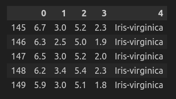
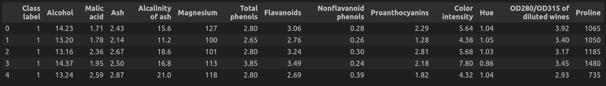

# Chapter 7: Ensemble Learning

## What is Ensemble Learning
Ensemble learning is a machine learning technique that combines predictions from multiple models to improve overall predictive performance compared to individual models. The idea is to leverage the diversity and complementary strengths of different models to create a more accurate and robust predictive system.

## Types of Ensemble Learning Techniques
**1. Bagging**
- Creates multiple models by training each on different bootstrapped samples (random samples with replacement).
- Predictions are made by aggregating predictions from all models.
- Reduces variance and improves accuracy.
- **Example Algorithms:**
  - Random Forest
  - Bagged Decision Trees

**2. Boosting**
- Sequentially trains models, giving more weight to incorrectly predicted instances in subsequent models.
- Aggregates weak learners to create a strong learner.
- Reduces both bias and variance.
- **Example Algorithms:**
  - AdaBoost (Adaptive Boosting)
  - Gradient Boosting (XGBoost, LightGBM, CatBoost)

**3. Stacking**
- Combines predictions of multiple base models using a meta-learner (blender).
- Base models are trained on the original dataset, and the meta-learner is trained on their predictions.
- Can mix models of different types.

**4. Voting**
- Aggregates predictions from different models by majority voting or averaging.
- Suitable for both classification and regression tasks.

**5. Blending**
- Similar to stacking but uses a holdout validation set for training the meta-learner instead of cross-validation predictions.
- Simpler to implement but less robust.

## Dataset
We have used the famous Iris dataset which is available [here](https://archive.ics.uci.edu/ml/machine-learning-databases/iris/iris.data). Here is a snippet of this dataset after loading it in a dataframe:

Moreover, we have also used the famous wine dataset which is available [here](https://archive.ics.uci.edu/ml/machine-learning-databases/wine/wine.data). Here is a snippet of this dataset after loading it in a dataframe:

