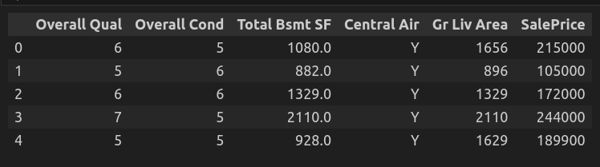

# Chapter 9: Regression

## What is Regression
Regression is a type of predictive modeling technique used in statistics and machine learning. It analyzes the relationship between a dependent (target) variable and one or more independent (predictor) variables. The goal is to understand how the typical value of the dependent variable changes when any one of the independent variables is varied, while the other independent variables are held fixed.

## Types of Regression
**1. Linear Regression**
The simplest form of regression that assumes a linear relationship between the dependent and independent variables.

**2. Polynomial Regression**
Extends linear regression by adding terms with powers greater than one of an independent variable.

**3. Logistic Regression**
Despite its name, it is used for binary classification rather than numerical prediction.

**4. Ridge Regression (L2 Regularization)**
Addresses some of the problems of Ordinary Least Squares by imposing a penalty on the size of coefficients.

**5. Lasso Regression (L1 Regularization)**
Similar to ridge regression but can shrink some coefficients to zero, performing variable selection.

**6. Elastic Net**
Combines penalties of ridge regression and lasso regression.

## Evaluation Metrics
Regression models are evaluated using several metrics:
- **Mean Absolute Error (MAE):** The mean of the absolute values of the individual prediction errors.
- **Mean Squared Error (MSE):** The mean of the squared prediction errors.
- **Root Mean Squared Error (RMSE):** The square root of MSE.
- **R-Squared (Coefficient of Determination):** Measures the proportion of variance in the dependent variable that is predictable from the independent variables.

## Dataset
We used Ames Housing dataset for regression. A full documentation of this dataset can be found [here](http://jse.amstat.org/v19n3/decock/DataDocumentation.txt). Below, you can see a snippet of this dataset after loading it in a dataframe:
