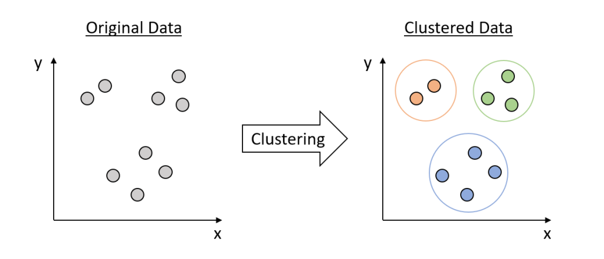

# Chapter 10: Clustering

## What is Clustering

Clustering is a type of unsupervised learning technique used in machine learning and data mining to group a set of objects in such a way that objects in the same group (called a cluster) are more similar to each other than to those in other groups. It's mainly used for exploratory data analysis to find natural groupings in data, without any associated labels.

## Types of Clustering Techniques
**1. K-Means Clustering**
The algorithm partitions the data into K distinct, non-overlapping clusters based on distance to the mean of the cluster. The goal is to minimize the within-cluster sum of squares.

**2. Hierarchical Clustering**
Builds a tree of clusters and does not require the number of clusters to be specified in advance. It can be either agglomerative (bottom-up) or divisive (top-down).

**3. DBSCAN (Density-Based Spatial Clustering of Applications with Noise)**
Groups together points that are close to each other based on a distance measurement (usually Euclidean distance) and a minimum number of points. It also marks as outliers the points that are in low-density regions.

**4. Mean Shift Clustering**
 Aims to discover blobs in a smooth density of samples. It is a centroid-based algorithm, which works by updating candidates for centroids to be the mean of the points within a given region.

**5. Affinity Propagation**
Sends messages between pairs of samples until convergence. A data point is chosen as a cluster center if it is representative of many other points.

## Evaluation Metrics
- **Silhouette Score:** Measures how similar a point is to its own cluster compared to other clusters.
- **Davies-Bouldin Index:** The average 'similarity' ratio between clusters, where similarity is a measure that compares the distance between clusters with the size of the clusters themselves.
- **Calinski-Harabasz Index:** Also known as the Variance Ratio Criterion, it measures the dispersion ratio between and within clusters.