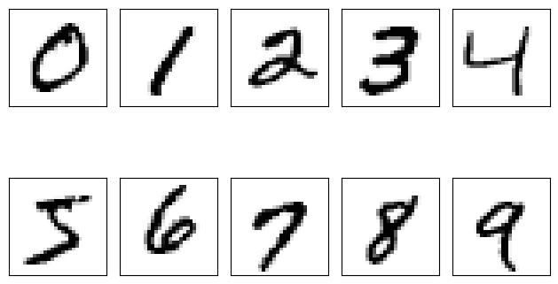

# Chapter 11: Multi-Layer Neural Network

## What is Multi-Layer Neural Network

A multi-layer neural network, often referred to as a deep neural network, is a type of artificial neural network that contains more than one layer of neurons. These networks are used to model complex patterns and solve various problems in areas such as image recognition, natural language processing, and more. Here’s an overview of how these networks function, and their structure.

## Structure of a Multi-Layer Neural Network
**1. Input Layer**
- Receives the raw input data.
- Acts as the starting point for data to be processed through the subsequent layers.

**2. Hidden Layers**
- Layers of neurons that are between the input and output layers.
- Each hidden layer takes the output from the previous layer, applies a weighted sum followed by a non-linear activation function, and passes the result to the next layer.
- The number of hidden layers and the number of neurons in each layer define the complexity and capacity of the network.

**3. Output Layer**
- The final layer that produces the output of the model.
- The design of the output layer varies based on the specific task (e.g., classification, regression).

## Neurons and Activation Functions
- **Neurons**
  - Basic computational units of the neural network.
  - Each neuron receives inputs, computes a weighted sum of these inputs, adds a bias, and applies an activation function.

- **Activation Functions**
  - Non-linear functions that help the network learn complex patterns.
  - Common examples include ReLU (Rectified Linear Unit), Sigmoid, and Tanh.

- **Forward Propagation**
  - Involves computing the output of the neural network by passing the input data forward through the layers.
  - Each neuron in a layer receives inputs from all the neurons in the previous layer, from which it computes an output that is passed on to the next layer.

- **Backpropagation**
  - A method used to train the network by adjusting the weights and biases.
  - It involves computing the gradient of the loss function (a measure of error) with respect to each weight and bias by applying the chain rule (from calculus), starting from the output layer back to the input layer.
  - The network learns by iteratively updating the weights and biases to minimize the loss function.

- **Learning Rate**
  - The step size at each iteration while moving toward a minimum of the loss function.
  - Too high a learning rate can cause the learning process to diverge, while too low a rate can slow down the convergence, potentially getting stuck in local minima.

- **Challenges**
 - **Overfitting:** Occurs when a model learns the detail and noise in the training data to the extent that it negatively impacts the performance of the model on new data.

- **Computational Demands:** Deep learning models, particularly those with many layers, require significant computational resources and data for training.

## Dataset
We have used the famous MNIST dataset which is available [here](http://yann.lecun.com/exdb/mnist/). Here is a snippet of this dataset after loading it:

