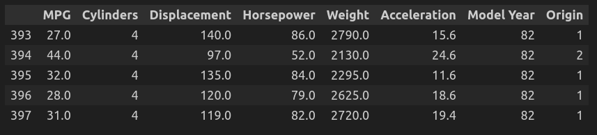

# Chapter 13: PyTorch In Depth

## What is PyTorch
PyTorch is an open-source machine learning library developed by Facebook's AI Research lab (FAIR). It's widely used for applications such as natural language processing and computer vision, primarily because it's flexible, powerful, and suits the needs of researchers and developers working on complex AI models. PyTorch is known for its ease of use, efficiency, and seamless ability to switch between CPUs and GPUs.

## Tensors
Tensors are the fundamental data structures in PyTorch, similar to arrays and matrices. They are used to encode the inputs and outputs of a model, as well as the model’s parameters. Tensors in PyTorch are similar to NumPy’s ndarrays, but with the added advantage of being able to run on GPUs to accelerate computing.

## torch.nn Module
The torch.nn module in PyTorch is a foundational pillar designed to help create and train neural networks. It contains definitions of a wide array of pre-built layers and also utilities to define own custom layers if needed.

## Custom Layers
Sometimes pre-defined layers in the torch.nn module are not sufficient to meet specific needs for complex models. PyTorch provides the flexibility to create custom layers by extending the nn.Module class.

## PyTorch Lightning
PyTorch Lightning is a library that builds on PyTorch to make powerful AI research reproducible, scalable, and faster to iterate on. It abstracts away much of the boilerplate code required in typical PyTorch workflows, leaving the researcher to focus more on the experiment itself rather than the underlying engineering.

## PyTorch Ignite
PyTorch Ignite is a library that helps with writing compact but full-featured training loops for PyTorch deep learning models. It aims to help scientists and engineers develop more complex, innovative, and reliable training loops faster by reducing boilerplate code and providing helpful utilities.

## Dataset
We used a dataset of cars for predicting the fuel efficiency of cars. You can download this dataset from [here](http://archive.ics.uci.edu/ml/machine-learning-databases/auto-mpg/auto-mpg.data). Below, you can see a snippet of this dataset after loading it in a dataframe:

Moreover, we have used the famous MNIST dataset which is available [here](http://yann.lecun.com/exdb/mnist/). Here is a snippet of this dataset after loading it:

