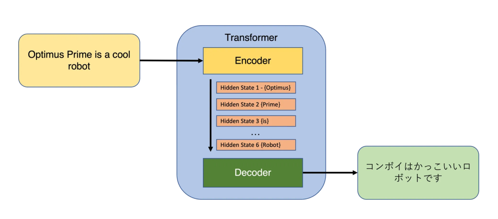

# Chapter 16: Transformers

## What are Transformers

Transformers are a groundbreaking architecture in machine learning that have revolutionized the way that models handle tasks involving sequences of data, particularly in the field of natural language processing (NLP). Snce 2017, transformers have become the backbone for many state-of-the-art NLP models, including BERT (Bidirectional Encoder Representations from Transformers), GPT (Generative Pre-trained Transformer), and many others.

## Components
Transformers are designed around the self-attention mechanism, which allows them to weigh the importance of different words in a sentence.

**1. Self-Attention**
The ability to attend to different positions of the input sequence to compute a representation of the sequence. Self-attention allows the model to consider the entire sequence simultaneously, making it powerful for tasks where context is important.

**2. Multi-Head Attention**
An extension of the attention mechanism that allows the model to jointly attend to information from different representation subspaces at different positions. This means the model can capture various aspects of semantic and syntactic information about the input sequence.

**3. Positional Encoding**
Since transformers do not use recurrence mechanisms or convolution, positional encodings are added to give the model some information about the relative or absolute position of the tokens in the sequence.

**4. Feed-Forward Neural Networks**
Each layer of the transformer includes a fully connected feed-forward network which is applied to each position separately and identically. This consists of two linear transformations with a ReLU activation in between.

**5. Layer Normalization and Residual Connections**
These components help stabilize the training of deep networks. Each sub-layer (like self-attention or the feed-forward neural network) in each encoder and decoder has a residual connection around it followed by layer normalization.

## Architecture
- **Encoder:** The encoder processes the input sequence and transforms it into a continuous representation that holds all the learned information of that input. The encoder consists of a stack of identical layers, each containing two main sub-layers: multi-head self-attention and a position-wise fully connected feed-forward network.
- **Decoder:** The decoder, also composed of a stack of identical layers, takes the output of the encoder and transforms it to provide the final output sequence. In addition to the two sub-layers in each encoder layer, the decoder inserts a third sub-layer, which performs multi-head attention over the output of the encoder stack.

## Dataset
We have used an IMDB dataset which is available [here](https://ai.stanford.edu/~amaas/data/sentiment/). Or you can simply download it with a python code provided in the [nootebook of this chapter](./ch16.ipynb).