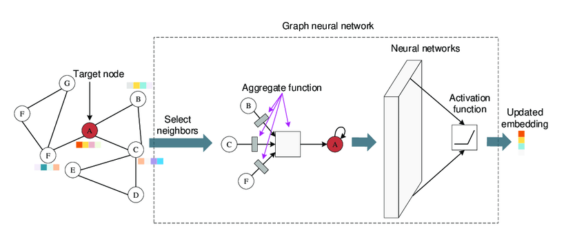

# Chapter 18: Graph Neural Networks (GNN)

## What is GNN

Graph Neural Networks (GNNs) are a type of neural network designed to operate directly on graphs, which are data structures consisting of nodes (vertices) and edges connecting them. GNNs are particularly useful for tasks that involve relational data, such as social networks, molecular structures, and recommendation systems.

## Concepts

### Node Features Aggregation
Each node in a graph starts with some features (or attributes). GNNs update the features of a node by aggregating the features of its neighboring nodes through a process often referred to as message passing. This aggregation helps incorporate local graph topology into the node representations.

### Message Passing
During each layer of a GNN, nodes send "messages" (usually some function of the features) to their neighbors. Common aggregation functions include sums, means, or max operations.

### Update Function
After aggregating messages from neighbors, each node updates its own features using a neural network. This step typically combines the old features of the node with the aggregated messages to form new, updated features.

### Readout or Pooling Layer
For tasks that require a representation of the entire graph (rather than individual nodes or edges), a GNN can employ a readout layer to aggregate features from all the nodes in the graph into a single graph-level representation.

