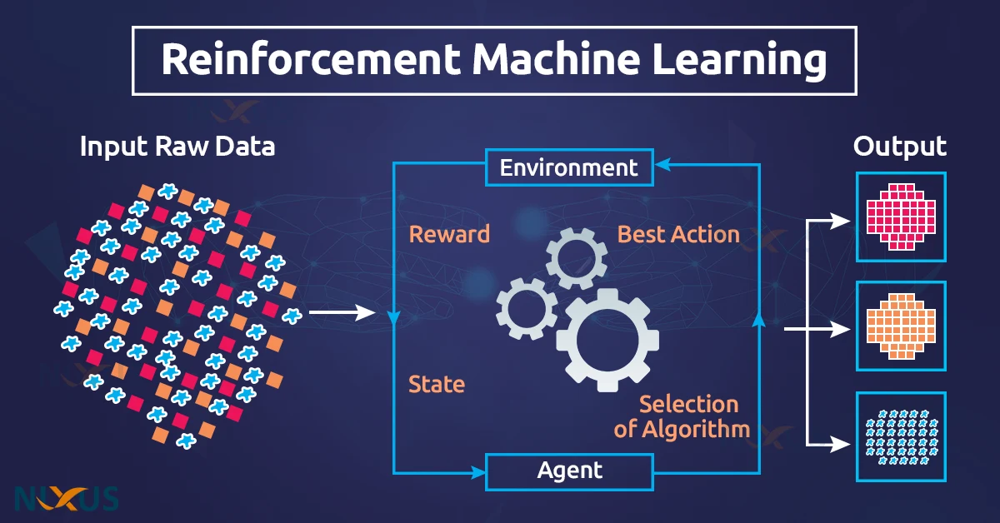

# Chapter 17: Reinforcement Learning (RL)

## What is RL

Reinforcement Learning (RL) is a type of machine learning where an agent learns to make decisions by performing actions in an environment to maximize some notion of cumulative reward. The process involves the agent interacting with its environment, learning from its actions based on feedback in the form of rewards or penalties, and adjusting its strategy to achieve better outcomes. 

## Concepts
### Agent
The learner or decision-maker that interacts with the environment.

### Environment
The world through which the agent moves, which provides specific states and feedback in response to the agent's actions.

### Action (A)
All the possible moves that the agent can make. The choice of action may depend on the current state and the learned policy.

### State (S)
The current situation returned by the environment to the agent. It can include observations that help the agent decide the next action.

### Reward (R)
Feedback from the environment in response to the actions taken by the agent. Rewards can be immediate or delayed, and they guide the agent in learning which actions lead to better long-term outcomes.

### Policy (π):
A strategy that the agent employs to determine the next action based on the current state. It can be deterministic (a specific action is chosen for a given state) or stochastic (actions are selected according to a probability distribution).

### Value Function
It estimates how good it is for the agent to be in a given state or how good it is to perform a certain action in a given state. This is often based on the total amount of reward expected to be accumulated in the future.

### Model of the Environment
While not always used, this is a representation of how the environment behaves. It predicts what the next state and reward will be for each action taken in the current state.

## Types
### Model-Based RL
In this type, the agent attempts to explicitly model the environment and uses this model to make decisions.

### Model-Free RL
The agent learns to act without attempting to model the dynamics of the environment. Two major approaches in model-free RL are:
- **Q-Learning:** A value-based learning model where the agent learns the value of taking actions in particular states.
- **Policy Gradient:** A policy-based approach where the agent directly optimizes the policy without using value estimation.

